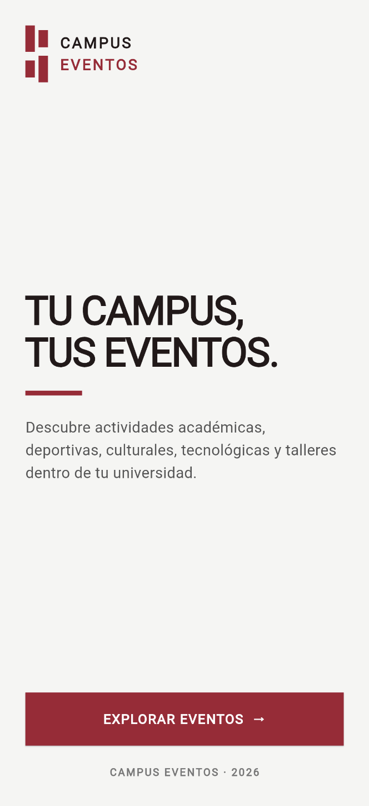
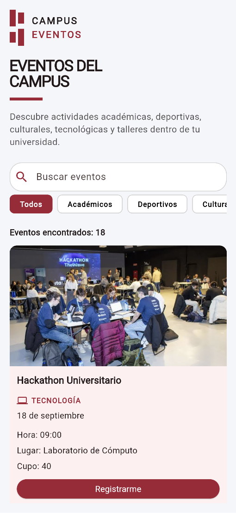
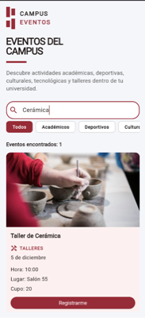
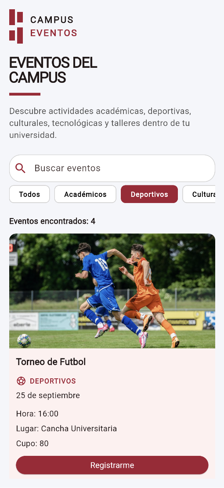
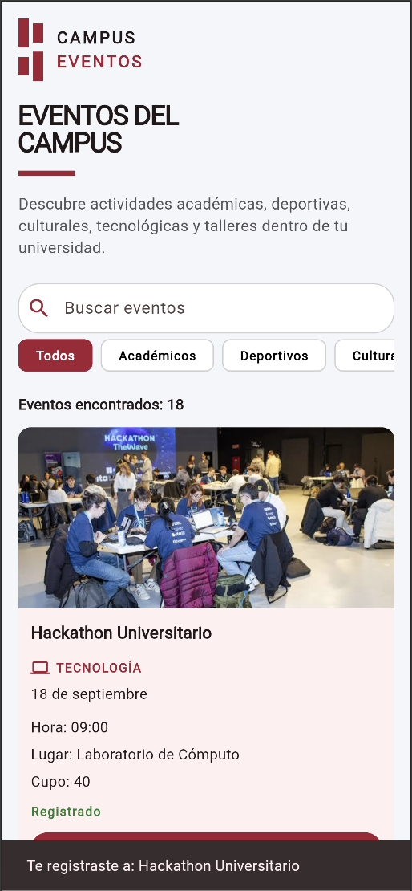
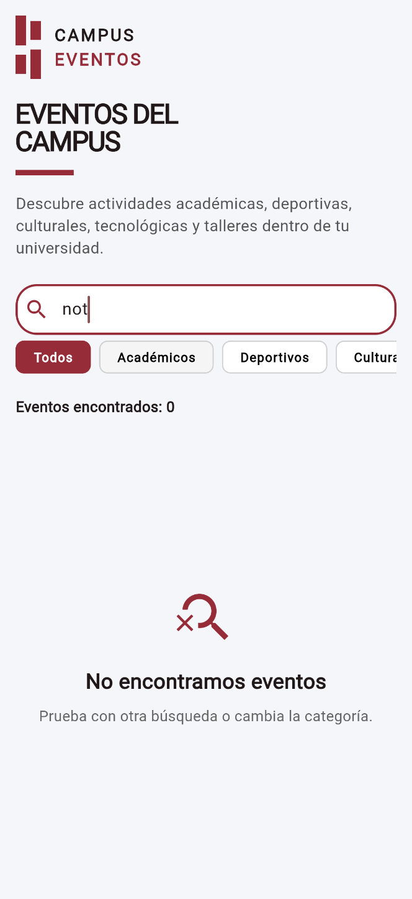
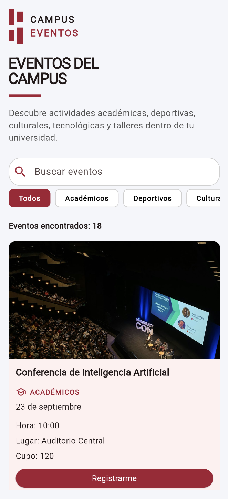
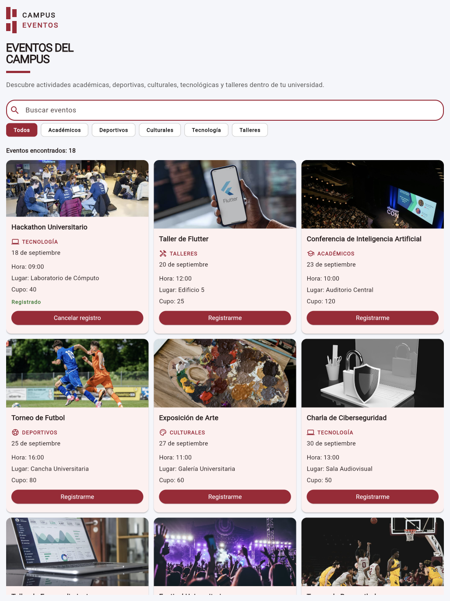

<div align="center">

# 🎓 Campus Eventos

[](https://flutter.dev/)
[](https://dart.dev/)
[](https://m3.material.io/)
[](https://github.com/)
[](LICENSE)

**A responsive Flutter application for discovering, filtering, and registering for university events**

</div>

---

## 🎯 About The Project

**Campus Eventos** is a responsive Flutter application designed to help university students discover activities and events happening around their campus.

The application provides an intuitive interface where users can browse academic, sports, cultural, technology, and workshop events. It includes dynamic search and filtering, responsive layouts, registration management, and visual feedback through SnackBars.

The project was developed as part of the **Mobile Device Programming** course.

### Why Campus Eventos?

- 🔎 **Dynamic event search** by title
- 🏷️ **Category filtering** for different types of events
- 🎟️ **Event registration and cancellation**
- 📱 **Responsive interface** for mobile, tablet, and desktop
- 🔔 **Interactive SnackBar notifications**
- 🎨 **Custom academic-inspired visual identity**

---

## ✨ Features

<table>
<tr>
<td width="50%">

### 🔎 Event Discovery

- Browse university events
- Search events dynamically
- Filter events by category
- Display the number of matching events
- Empty state when no results are found
- Category-specific icons

</td>

<td width="50%">

### 🎟️ Registration Features

- Register for university events
- Cancel existing registrations
- Visual registered status
- Dynamic registration button
- Confirmation messages using SnackBars
- Registration state updates using `setState()`

</td>
</tr>
</table>

---

## 📸 Demo

<div align="center">

### Welcome & Home

| Welcome Screen | Event Catalog |
| :---: | :---: |
|  |  |

### Event Discovery

| Search | Categories |
| :---: | :---: |
|  |  |

### Registration

| Registered Event | Empty State |
| :---: | :---: |
|  |  |

### Responsive Design

| Mobile | Tablet |
| :---: | :---: |
|  |  |

</div>

---

## 🚀 Installation

### Prerequisites

Before you begin, ensure you have the following installed:

| Requirement | Version | Download |
| --- | --- | --- |
| Flutter SDK | Latest stable | [Download](https://docs.flutter.dev/get-started/install) |
| Dart SDK | Included with Flutter | [Documentation](https://dart.dev/) |
| Git | Latest | [Download](https://git-scm.com/) |
| VS Code | Latest | [Download](https://code.visualstudio.com/) |

> 💡 **Tip:** Run `flutter doctor` before starting the project to verify that your Flutter environment is configured correctly.

### Quick Start

```bash
# Clone the repository
git clone https://github.com/cesarMalanco/CampusEventos.git

# Navigate to the Flutter project
cd CampusEventos/eventos_universitarios

# Install project dependencies
flutter pub get

# Run the application
flutter run
```

To view the available devices:

```bash
flutter devices
```

To run the application in Chrome:

```bash
flutter run -d chrome
```

---

## 📅 Event Data

### Event Storage

The application stores the event information separately from the user interface in:

```text
lib/data/event_data.dart
```

Each event contains information such as:

```dart
{
  'titulo': 'Hackathon Universitario',
  'categoria': 'Tecnología',
  'fecha': '18 de septiembre',
  'hora': '09:00',
  'lugar': 'Laboratorio de Cómputo',
  'cupo': 40,
  'imagen': 'https://example.com/image.jpg',
}
```

### Available Categories

The application includes the following event categories:

- Académicos
- Deportivos
- Culturales
- Tecnología
- Talleres

The **Todos** option displays all available events.

---

## 💻 Usage

### Running the Application

**Option 1: Command Line**

```bash
flutter run
```

**Option 2: Chrome**

```bash
flutter run -d chrome
```

**Option 3: VS Code**

1. Open the `eventos_universitarios` folder.
2. Select a Flutter device.
3. Press `F5` or click **Run and Debug**.

### Using Campus Eventos

1. Open the application.
2. Press **Explore Events** on the welcome screen.
3. Browse the available university events.
4. Use the search bar to find events by title.
5. Select a category to filter the event catalog.
6. Press **Register** to register for an event.
7. The event will display a **Registered** status.
8. Press **Cancel Registration** to remove the registration.

---

## 🛠️ Tech Stack

<div align="center">

| Technology | Purpose |
| :---: | :---: |
|  | Primary Language |
|  | Application Framework |
|  | UI Components |
|  | Version Control |
|  | Repository Hosting |

</div>

### Flutter Concepts

```text
StatefulWidget
StatelessWidget
setState()
ListView.builder
GridView.builder
LayoutBuilder
ChoiceChip
Card
Image.network
TextField
SnackBar
Navigator
Row
Column
```

---

## 📁 Project Structure

```text
CampusEventos/
│
├── 📱 eventos_universitarios/
│   │
│   ├── lib/
│   │   │
│   │   ├── main.dart                     # Application entry point
│   │   │
│   │   ├── 📂 data/
│   │   │   └── event_data.dart           # Event information & categories
│   │   │
│   │   ├── 📱 screens/
│   │   │   ├── welcome_page.dart         # Welcome screen
│   │   │   └── home_page.dart            # Main event catalog
│   │   │
│   │   ├── 🧩 widgets/
│   │   │   ├── campus_logo.dart          # Custom Campus Eventos logo
│   │   │   ├── category_chip.dart        # Category filter widget
│   │   │   └── event_card.dart           # Event information card
│   │   │
│   │   └── 🎨 theme/
│   │       └── app_theme.dart             # Application visual theme
│   │
│   ├── android/                           # Android configuration
│   ├── ios/                               # iOS configuration
│   ├── macos/                             # macOS configuration
│   ├── web/                               # Web configuration
│   ├── test/                              # Flutter tests
│   └── pubspec.yaml                       # Flutter dependencies
│
├── 📂 screenshots/                        # Demo screenshots
├── LICENSE
└── README.md
```

---

## 📝 License

This project is licensed under the MIT License - see the [LICENSE](LICENSE) file for details.

---

## 👤 Author

<div align="center">

**César Malanco**

[](https://github.com/cesarMalanco)

---

<sub>Built with ❤️ using Flutter and Dart</sub>

</div>